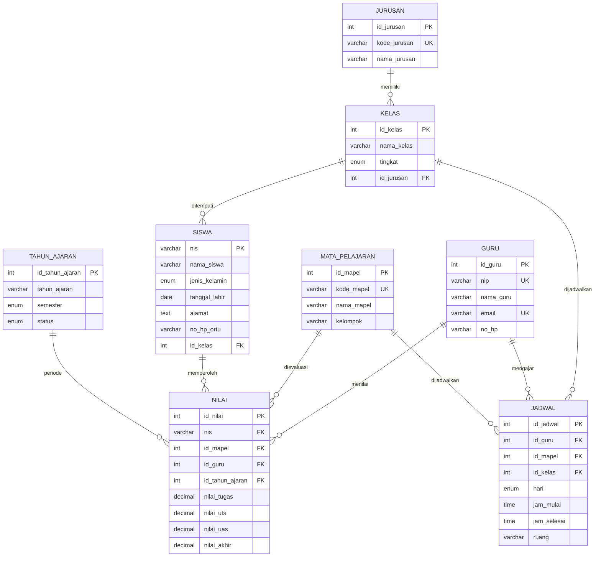

# Sistem Informasi Akademik (SIA) SMK Negeri 2 Magelang
### *Akademi Mumtaz — Portal Akademik & Manajemen Rapor Terpadu*

[](https://react.dev/)
[](https://www.typescriptlang.org/)
[](https://vitejs.dev/)
[](https://tailwindcss.com/)
[](https://mariadb.org/)

---

## 📌 Tentang Proyek

**SIA SMK Negeri 2 Magelang (Akademi Mumtaz)** adalah platform Sistem Informasi Akademik terpadu berbasis web yang dirancang untuk mengelola data operasional pendidikan, mulai dari biodata peserta didik, data tenaga pendidik, alokasi jadwal pelajaran per rombongan belajar (rombel), hingga evaluasi nilai dan cetak rapor siswa.

Aplikasi ini mengacu pada skema basis data relasional MariaDB terstruktur (`db_sia_smkn2_magelang`) yang mencakup 8 entitas inti yang saling terintegrasi dengan antarmuka modern yang responsif, serta simulasi otentikasi multi-peran (Admin, Guru, dan Siswa).

---

## ✨ Fitur-Fitur Utama

### 1. 🌐 Landing Page & Akses Multi-Peran
- Beranda informatif dengan ringkasan statistik sekolah dan profil kejuruan.
- **Autentikasi Multi-Role**:
  - **Administrator**: Akses penuh ke seluruh data sekolah, rombel, buku nilai, dan inspeksi basis data.
  - **Guru**: Monitoring beban mengajar, jadwal mengampu di ruang kelas/lab, dan input nilai siswa.
  - **Siswa**: Tinjau histori nilai pribadi, status ketuntasan KKM, jadwal kelas, dan pratinjau e-rapor.
- Tombol **Demo 1-Klik** untuk pengujian cepat tiap peran tanpa perlu mengetik kredensial manual.

### 2. 📊 Dasbor Ringkasan (Overview)
- Metrik KPI utama: Total Siswa, Guru, Rombel, Mata Pelajaran, Jadwal Aktif, dan Rata-rata Nilai Sekolah.
- Rasio kelulusan KKM (Kriteria Ketuntasan Minimal 75.0) dan demografi gender siswa.
- Distribusi siswa per konsentrasi keahlian/jurusan.
- Pratinjau jadwal ruang harian serta daftar siswa berprestasi.

### 3. 👥 Manajemen Data Siswa (`SiswaView`)
- Pencarian cerdas dan filter multi-kriteria (Tingkat X/XI/XII, Rombel, Jurusan, Gender, dan Status Ketuntasan).
- Form penambahan data siswa baru secara dinamis.
- Profil siswa lengkap disertai NIS, tanggal lahir, alamat, serta rata-rata akademik.

### 4. 📄 Rapor Siswa Siap Cetak (`StudentRaporModal`)
- Rekapitulasi nilai mata pelajaran per semester lengkap dengan bobot dan predikat (A, B, C, D).
- Penilaian deskriptif status ketercapaian kompetensi terhadap KKM (75.0).
- Kolom tanda tangan resmi Kepala Sekolah dan Wali Kelas.
- Dukungan **Cetak Rapor Langsung** (`Print-to-PDF / Paper`) yang ramah cetak.

### 5. 📝 Buku Nilai & Evaluasi (`NilaiView`)
- Formula perhitungan nilai akhir otomatis berstandar:
  $$\text{Nilai Akhir} = (30\% \times \text{Tugas}) + (30\% \times \text{UTS}) + (40\% \times \text{UAS})$$
- Pengubahan nilai secara langsung (*inline modal*) dengan kalkulasi instan.
- Filter berdasarkan mata pelajaran, guru pengampu, rombel kelas, dan status KKM.
- Fitur **Export Data Nilai ke format CSV** untuk arsip dan administrasi.

### 6. 📅 Jadwal Pelajaran & Ruang Lab (`JadwalView`)
- Tampilan dua mode: **Tampilan Matriks Harian** (Senin s.d. Jumat) dan **Tampilan Daftar (List View)**.
- Alokasi ruang pembelajaran (Lab Komputer 1-3, Lab Akuntansi, Lab Perkantoran, dan Ruang Teori).
- Filter jadwal berdasarkan hari, kelas, maupun guru pengajar.
- Opsi cetak jadwal pelajaran resmi sekolah.

### 7. 👨‍🏫 Direktori Tenaga Pendidik (`GuruView`)
- Informasi data guru terdaftar, NIP, email dinas, dan nomor kontak.
- Pemetaan muatan ajar yang diampu serta rekapitulasi penilaian kelas.

### 8. 📚 Kurikulum, Jurusan & Rombel (`KurikulumView`)
- Profil 5 Konsentrasi Keahlian:
  - **PPLG** (Pengembangan Perangkat Lunak dan Gim)
  - **AKL** (Akuntansi dan Keuangan Lembaga)
  - **MPLB** (Manajemen Perkantoran dan Layanan Bisnis)
  - **PM** (Pemasaran)
  - **DKV** (Desain Komunikasi Visual)
- Katalog mata pelajaran kelompok Kejuruan dan Umum beserta alokasi pengajar.

### 9. 🗄️ Database Inspector (`DatabaseInspectorView`)
- Visualisasi struktur tabel dan skema DDL (*Data Definition Language*) MariaDB 12.3.
- Inspeksi isi data relasional tiap tabel secara real-time.
- Fitur salin sintaks SQL CREATE TABLE dan tombol reset basis data ke *seed* awal.

---

## 🗂️ Arsitektur Skema Basis Data

Sistem didasarkan pada basis data `db_sia_smkn2_magelang` dengan 8 tabel relasional:



---

## 🔑 Kredensial Uji Coba (Demo Accounts)

Anda dapat masuk menggunakan form autentikasi di halaman utama atau langsung menggunakan tombol demo peran:

| Peran | Pengenal (Identifier / Login) | Kredensial / Sandi | Deskripsi |
|---|---|---|---|
| **Administrator** | `admin` | *(bebas / admin123)* | Akses penuh pengelolaan SIA |
| **Guru** | `198001012005011001` | *(bebas / guru123)* | Akun Budi Santoso, M.Kom. (Guru Basis Data) |
| **Siswa** | `2401` | *(tanggal lahir / 123456)* | Akun Aditya Pratama (Kelas XI PPLG 1) |

---

## 🚀 Panduan Menjalankan Proyek

### Prasyarat
- [Node.js](https://nodejs.org/) versi 18 atau yang lebih baru
- [npm](https://www.npmjs.com/) versi 9 atau yang lebih baru

### 1. Clone Repositori
```bash
git clone https://github.com/MumtazGenk/Akademi-Mumtaz.git
cd Akademi-Mumtaz
```

### 2. Instal Dependensi
```bash
npm install
```

### 3. Konfigurasi Lingkungan (Opsional)
Salin berkas `.env.example` menjadi `.env.local` jika ingin mengonfigurasi variabel lingkungan:
```bash
cp .env.example .env.local
```

### 4. Jalankan Server Pengembangan
```bash
npm run dev
```
Aplikasi akan aktif dan dapat diakses melalui peramban web di:
```text
http://localhost:3000
```

### 5. Perintah Lain yang Tersedia
- `npm run build` — Melakukan kompilasi aset produksi melalui Vite.
- `npm run preview` — Meninjau hasil kompilasi produksi secara lokal.
- `npm run lint` — Melakukan pemeriksaan tipe statis TypeScript (`tsc --noEmit`).
- `npm run clean` — Membersihkan folder artefak build `dist`.

---

## 📁 Struktur Direktori

```text
sistem-akademik/
├── index.html                   # Entri berkas HTML utama & konfigurasi font
├── metadata.json                # Metadata profil aplikasi
├── package.json                 # Konfigurasi dependensi dan skrip proyek
├── tsconfig.json                # Konfigurasi TypeScript compiler
├── vite.config.ts               # Konfigurasi Vite, Tailwind & path aliases
├── public/                      # Aset publik statis
└── src/
    ├── App.tsx                  # Komponen induk aplikasi & perutean tampilan
    ├── main.tsx                 # Titik masuk rendering React DOM
    ├── types.ts                 # Definisi antarmuka & tipe data TypeScript
    ├── index.css                # Gaya dasar Tailwind CSS
    ├── context/
    │   └── DatabaseContext.tsx  # State management terpusat, autentikasi, & relasi
    ├── data/
    │   └── databaseData.ts      # Data inisial (seed) MariaDB & definisi skema DDL
    └── components/
        ├── Header.tsx           # Navigasi atas, status database, & profil user
        ├── NavigationTabs.tsx   # Bilah tab navigasi modul aplikasi
        ├── landing/
        │   └── LandingPage.tsx  # Halaman beranda & portal masuk multi-peran
        ├── modals/
        │   └── StudentRaporModal.tsx # Pratinjau & format cetak rapor peserta didik
        └── views/
            ├── OverviewView.tsx          # Dasbor ringkasan analitik & metrik
            ├── SiswaView.tsx             # Manajemen & direktori siswa
            ├── JadwalView.tsx            # Penjadwalan & penggunaan ruang belajar
            ├── NilaiView.tsx             # Pengelolaan buku nilai & ekspor CSV
            ├── GuruView.tsx              # Direktori tenaga pendidik
            ├── KurikulumView.tsx         # Struktur kurikulum, jurusan & mapel
            └── DatabaseInspectorView.tsx # Pemeriksa struktur DDL basis data
```

---

## 🛠️ Tumpukan Teknologi

- **Frontend Core**: [React 19](https://react.dev/) & [TypeScript](https://www.typescriptlang.org/)
- **Bundler & Tooling**: [Vite 6](https://vitejs.dev/)
- **Styling**: [Tailwind CSS v4](https://tailwindcss.com/)
- **Animasi**: [Motion](https://motion.dev/)
- **Ikon**: [Lucide React](https://lucide.dev/)
- **Desain Tipografi**: Plus Jakarta Sans & JetBrains Mono

---

## 📝 Lisensi & Hak Cipta

Proyek ini dikembangkan untuk kebutuhan akademik dan portofolio **SMK Negeri 2 Magelang** di bawah repositori **Akademi-Mumtaz**.
Dikelola oleh tim pengembang [MumtazGenk](https://github.com/MumtazGenk).
