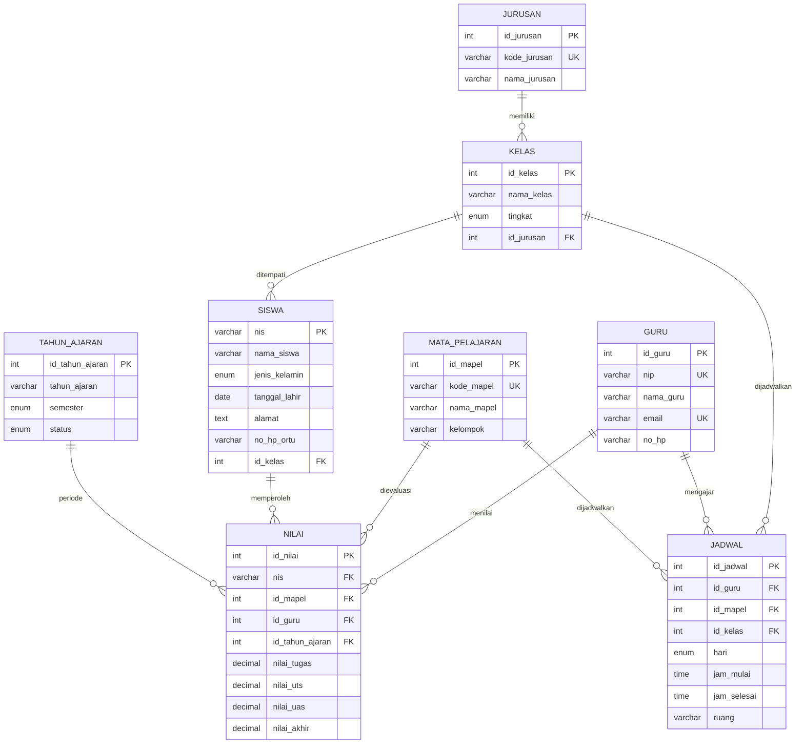

# Sistem Informasi Akademik (SIA) SMK Negeri 2 Magelang

Aplikasi web Sistem Informasi Akademik (SIA) untuk pengelolaan data operasional sekolah: biodata siswa, data guru, penjadwalan rombongan belajar (rombel), rekapitulasi buku nilai, dan pencetakan rapor semester.

Aplikasi ini menggunakan skema basis data relasional 8 entitas (`db_sia_smkn2_magelang.sql`). Data dapat berjalan langsung di peramban menggunakan data awal (in-memory seed) atau tersambung ke backend Supabase.

## Fitur Utama

- **Akses Multi-Peran**: Pembagian hak akses untuk Administrator, Guru, dan Siswa, dilengkapi fitur demo login satu klik.
- **Dasbor Ringkasan**: Statistik total siswa, guru, rombel, distribusi jurusan, jadwal hari berjalan, dan persentase ketuntasan KKM.
- **Manajemen Siswa**: Direktori data siswa per tingkat (X, XI, XII) dan konsentrasi keahlian, pencarian nama/NIS, serta form penambahan siswa baru.
- **Buku Nilai & Evaluasi**: Input dan pembaruan nilai (Tugas, UTS, UAS), status ketuntasan otomatis, dan ekspor data nilai ke format CSV.
- **Cetak Rapor Siswa**: Format cetak rapor semester per siswa, mencakup rekap nilai, predikat, catatan capaian kompetensi, dan lembar tanda tangan.
- **Jadwal Pelajaran & Ruang**: Tampilan matriks mingguan dan tabel daftar per hari, kelas, guru pengampu, serta alokasi ruang teori dan laboratorium.
- **Direktori Guru & Kurikulum**: Data NIP, kontak, pembagian mata pelajaran umum dan kejuruan di 5 konsentrasi keahlian (PPLG, AKL, MPLB, PM, DKV).
- **Inspektur Basis Data**: Peninjau skema relasional, struktur DDL tabel MariaDB, data tabel mentah, dan opsi reset data awal.

## Aturan Penilaian

Perhitungan nilai akhir menggunakan bobot:

$$\text{Nilai Akhir} = (30\% \times \text{Tugas}) + (30\% \times \text{UTS}) + (40\% \times \text{UAS})$$

- **KKM Sekolah**: 75.00
- **Skala Predikat**:
  - `A` : 90.00 - 100.00
  - `B` : 80.00 - 89.99
  - `C` : 75.00 - 79.99 (Tuntas KKM)
  - `D` : < 75.00 (Belum Tuntas / Perlu Remedial)

## Akun Demo

Untuk pengujian cepat tanpa mengisi form login, gunakan tombol peran demo di halaman login atau masukkan kredensial berikut:

| Peran | Pengenal (NIS / NIP / Username) | Kata Sandi | Cakupan Akses |
|---|---|---|---|
| Administrator | `admin` | `admin123` | Akses penuh: kelola semua data, jadwal, nilai, kurikulum, dan inspeksi DDL database |
| Guru | `198001012005011001` | `guru123` | Akun Budi Santoso, M.Kom. Akses jadwal mengajar dan input/edit nilai siswa |
| Siswa | `2401` | `123456` | Akun Aditya Pratama (XI PPLG 1). Akses profil pribadi, jadwal kelas, riwayat nilai, dan cetak rapor |

*Catatan: Pada form login pengujian, sistem memvalidasi kecocokan pengenal. Kata sandi demo di atas dapat disesuaikan.*

## Skema Basis Data

Sistem menggunakan 8 tabel relasional yang didefinisikan dalam berkas `db_sia_smkn2_magelang.sql`:



### Import Skema ke MariaDB / MySQL Lokal

Untuk menjalankan skema database pada instance MariaDB atau MySQL lokal:

```bash
# Menggunakan MariaDB
mariadb -u root -p < db_sia_smkn2_magelang.sql

# Atau menggunakan klien MySQL
mysql -u root -p < db_sia_smkn2_magelang.sql
```

Perintah di atas akan membuat basis data `db_sia_smkn2_magelang` beserta seluruh tabel relasional dan data awal (seed).

## Menjalankan Proyek

### Prasyarat
- Node.js versi 18 atau lebih baru
- npm versi 9 atau lebih baru

### 1. Pasang Dependensi
```bash
npm install
```

### 2. Konfigurasi Lingkungan (Opsional)
Aplikasi dapat berjalan langsung tanpa konfigurasi database eksternal (menggunakan state lokal berbasis seed SQL). Jika ingin menghubungkan ke Supabase, salin berkas contoh:

```bash
cp .env.example .env.local
```

Isi konfigurasi Supabase pada berkas `.env.local`:
```env
VITE_SUPABASE_URL="https://<project-ref>.supabase.co"
VITE_SUPABASE_ANON_KEY="<your-supabase-anon-key>"
```

### 3. Jalankan Server Pengembangan
```bash
npm run dev
```

Aplikasi dapat diakses melalui peramban web di `http://localhost:3000`.

### 4. Perintah Skrip yang Tersedia
- `npm run dev` : Menjalankan server pengembangan Vite di `localhost:3000`.
- `npm run build` : Melakukan kompilasi produksi ke direktori `dist/`.
- `npm run preview` : Menjalankan server lokal untuk menguji build produksi.
- `npm run lint` : Menjalankan pemeriksaan tipe TypeScript statis (`tsc --noEmit`).
- `npm run clean` : Menghapus folder artefak build `dist/`.

## Struktur Direktori

```text
sistem-akademik/
|-- db_sia_smkn2_magelang.sql    # Skema DDL dan data seed MariaDB
|-- index.html                   # Berkas HTML utama
|-- package.json                 # Konfigurasi dependensi dan skrip
|-- tsconfig.json                # Konfigurasi compiler TypeScript
|-- vite.config.ts               # Konfigurasi bundler Vite
|-- public/                      # Aset statis
`-- src/
    |-- App.tsx                  # Komponen utama dan perutean modul
    |-- main.tsx                 # Titik masuk rendering React DOM
    |-- types.ts                 # Definisi tipe data dan antarmuka TypeScript
    |-- context/
    |   `-- DatabaseContext.tsx  # Pengelolaan state, relasi, dan integrasi Supabase
    |-- data/
    |   `-- databaseData.ts      # Data seed awal dan skema DDL
    |-- lib/
    |   `-- supabase.ts          # Klien koneksi Supabase
    |-- components/
        |-- Header.tsx           # Navigasi atas dan indikator status database
        |-- NavigationTabs.tsx   # Bilah pergantian modul halaman
        |-- landing/
        |   `-- LandingPage.tsx  # Halaman beranda dan autentikasi peran
        |-- modals/
        |   `-- StudentRaporModal.tsx # Pratinjau dan format cetak rapor
        `-- views/
            |-- OverviewView.tsx          # Ringkasan analitik dan metrik sekolah
            |-- SiswaView.tsx             # Manajemen dan pencarian data siswa
            |-- JadwalView.tsx            # Penjadwalan kelas dan pemakaian ruang
            |-- NilaiView.tsx             # Rekap buku nilai dan ekspor CSV
            |-- GuruView.tsx              # Direktori data tenaga pendidik
            |-- KurikulumView.tsx         # Struktur jurusan dan mata pelajaran
            `-- DatabaseInspectorView.tsx # Peninjau struktur DDL basis data
```

## Tumpukan Teknologi

- **Frontend Core**: React 19, TypeScript 5.8
- **Tooling & Bundler**: Vite 6
- **Styling**: Tailwind CSS v4
- **Database & Storage**: MariaDB 12.3 (`db_sia_smkn2_magelang.sql`) dan Supabase Client
- **Animasi & Ikon**: Motion, Lucide React
